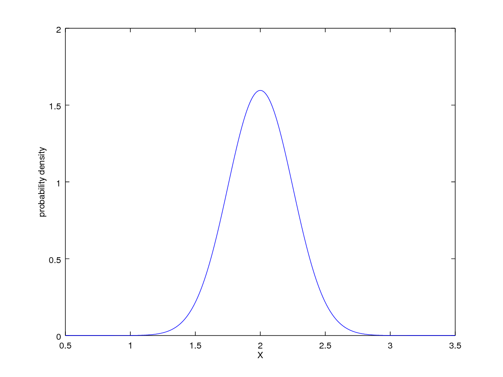
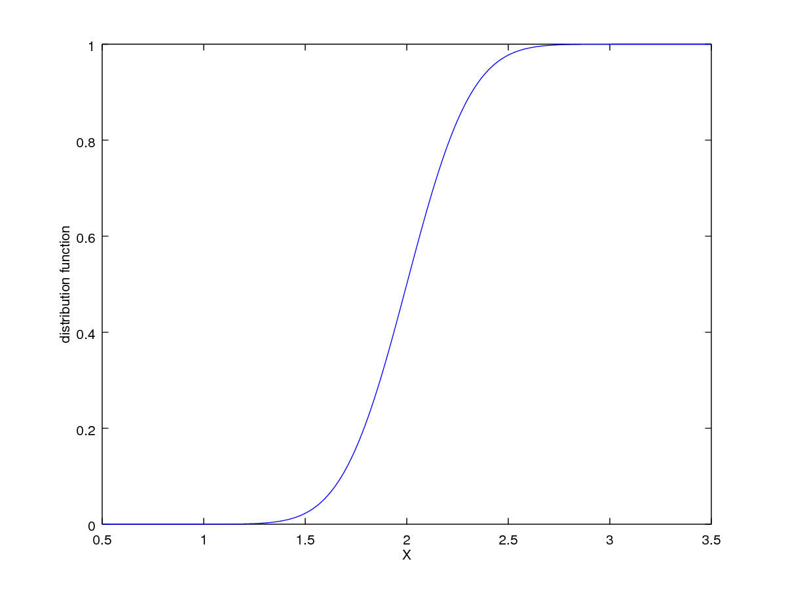
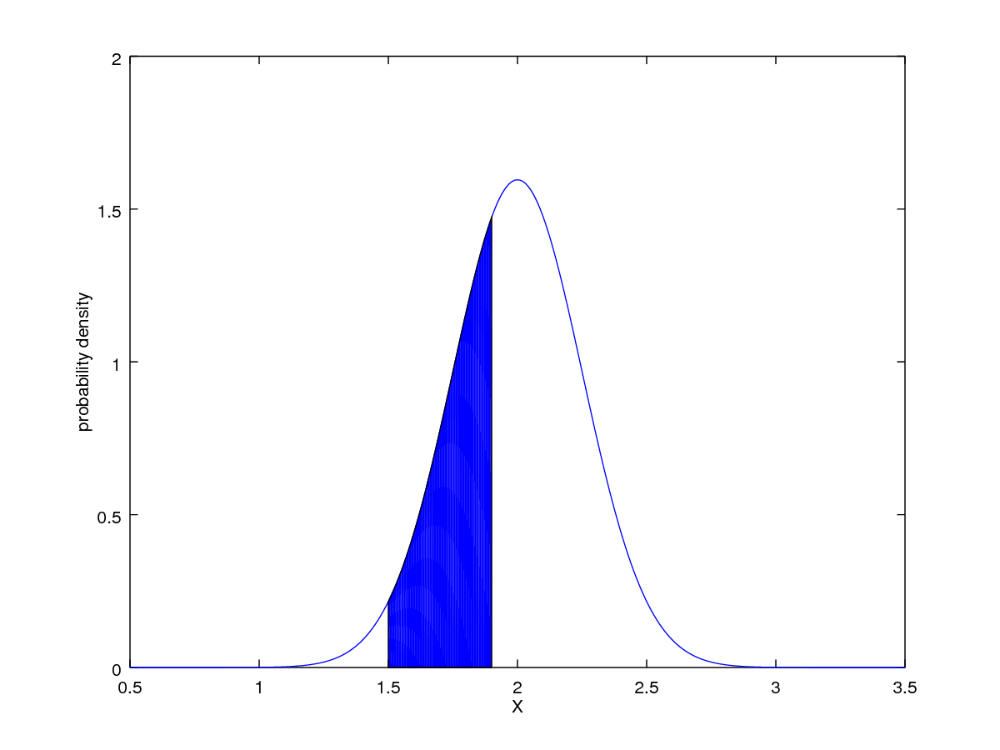

###概率论与数理统计第一次作业
16级计科7班 颜彬
用matlab编程语言实现求解下列问题，设随机变量$X \sim N(2, 0.25)$
####Ex1
求概率$P\{0.5<X<2.5\}$
``` matlab
mu = 2
sigma = 0.25
P = normcdf(2.5, mu, sigma) - normcdf(0.5, mu, sigma)
```
``` matlab
P =  0.97725
```
####Ex2
绘制分布函数图和分布概率密度图;
**概率密度**
``` matlab
x = [0.5 : 0.01 : 3.5]
y = normpdf(x, mu, sigma)
plot(x, y), xlabel('X'), ylabel('probability density')
```

**分布函数图**
``` matlab
x = [0.5 : 0.01 : 3.5]
y = normcdf(x, mu, sigma)
plot(x, y),
    xlabel('X'),
    ylabel('distribution function')
```

####Ex3
画出区间`[1.5, 1.9]`上的分布密度曲线下方区域。
``` matlab
mu = 2;
sigma = 0.25;
x1 = [0.5 : 0.01 : 3.5];
x2 = [1.5 : 0.01 : 1.9]; % x of fill-in area
y1 = normpdf(x1, mu, sigma);
y2 = normpdf(x2, mu, sigma);
n = size(x2, 2) % n is x1/x2's num of columns
plot(x1, y1),
    hold,
    fill([x2, fliplr(x2)],
        [zeros(1, n), fliplr(y2)], 'b'),
    xlabel('X'),
    ylabel('probability density');
```
